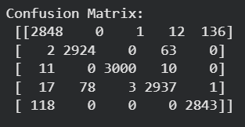
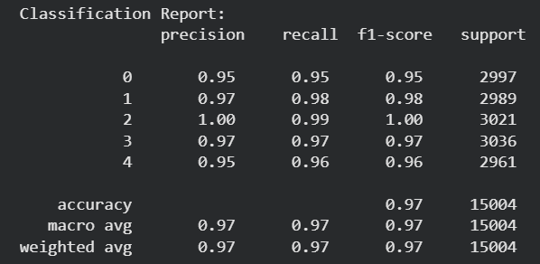

# 🌾 Rice Grain Classification using Computer Vision & KNN

## 📖 Overview

This project implements a Computer Vision and Machine Learning pipeline to classify five rice grain varieties using image processing techniques and a K-Nearest Neighbors (KNN) classifier.

The system extracts morphological features from rice grain images, including area, perimeter, eccentricity, and compactness, and uses these features to accurately identify different rice varieties.

---

## 🚀 Features

* Classifies **5 rice grain varieties**
* Processes **75,000+ rice grain images**
* Performs image preprocessing using OpenCV
* Extracts contour-based morphological features
* Trains a K-Nearest Neighbors (KNN) classifier
* Evaluates model performance using multiple metrics
* Includes image upload and prediction functionality

---

## 🛠️ Tech Stack

* Python
* OpenCV
* NumPy
* Pandas
* Matplotlib
* Scikit-Learn
* Google Colab

---

## 📊 Dataset

| Property         | Value            |
| ---------------- | ---------------- |
| Classes          | 5 Rice Varieties |
| Images per Class | ~15,000          |
| Total Images     | ~75,000          |
| Train-Test Split | 80:20            |

### Rice Varieties

* Arborio
* Basmati
* Ipsala
* Jasmine
* Karacadag

---

## 🔍 Exploratory Data Analysis

The project includes:

* Visualization of sample images from each rice variety
* Grayscale intensity histogram analysis
* Distribution comparison across classes

---

## ⚙️ Image Processing Pipeline

Each image undergoes the following preprocessing steps:

1. Grayscale Conversion
2. Gaussian Blurring
3. Binary Thresholding
4. Contour Detection
5. Feature Extraction

### Extracted Features

| Feature      | Description          |
| ------------ | -------------------- |
| Area         | Grain area in pixels |
| Perimeter    | Boundary length      |
| Eccentricity | Shape elongation     |
| Compactness  | Shape compactness    |

---

## 🤖 Machine Learning Model

### Algorithm

**K-Nearest Neighbors (KNN)**

### Model Configuration

* K Value: 3
* Train-Test Split: 80:20
* Random State: 42

---

## 📈 Model Performance

### Test Set Results

| Metric | Score |
|----------|---------|
| Accuracy | 96.99% |
| Precision | 0.97 |
| Recall | 0.97 |
| F1-Score | 0.97 |

The model demonstrates strong classification performance across all five rice grain varieties.

### Confusion Matrix



### Classification Report



---

## 🧪 Prediction System

The project includes an interactive prediction pipeline that allows users to upload a rice grain image and receive a classification prediction.

### Example Prediction

```text
Input Image: Jasmine (3165).jpg

Predicted Class: Jasmine
```

### Automated Random Testing

Random images from the dataset are selected and evaluated automatically.

Each prediction displays:

- Actual Label
- Predicted Label
- Correct/Incorrect Status


## 📁 Workflow

Rice Images

↓

Image Preprocessing

↓

Contour Detection

↓

Feature Extraction

↓

Dataset Creation

↓

Train-Test Split

↓

KNN Training

↓

Model Evaluation

↓

Prediction

---

## 🎯 Key Learnings

* Computer Vision with OpenCV
* Image Preprocessing Techniques
* Feature Engineering
* Exploratory Data Analysis (EDA)
* Machine Learning Classification
* Model Evaluation
* End-to-End ML Pipeline Development

---
